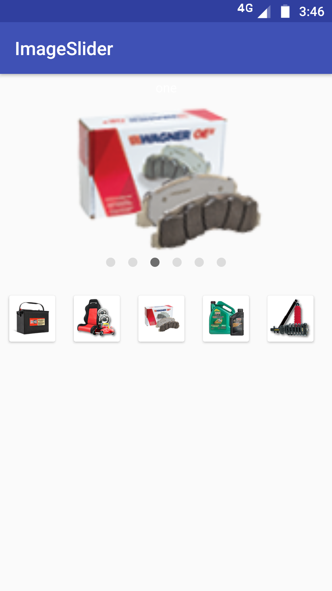

# ImageSliderrKotlin



in project level build.gradle add following

```
allprojects {
    repositories {
       --------        
       --------
        maven { url 'https://jitpack.io' } 
    }
  }
```
In app level build.gradle file add following
```
dependencies {
    -----
    implementation 'com.github.venkateshguddanti:ImageSliderrKotlin:1.1.0'
}
```
For downloading images in slider this library uses [Fresco](http://frescolib.org/)
In your project level applicaiton intialise Fresco and declare the same  in project manifest file.

Applicaiton file

```
class YourApplication : android.app.Application() {

   
    override fun onCreate() {
        super.onCreate()
        Fresco.initialize(this);
        
    }
 
}
```

In .xml Layout declare slider Preferebly give height  >= 300dp (Because image height in slider is 250dp)
```
 <org.hm.com.imageslider.ImageSlider
        android:id="@+id/slider"
        android:layout_width="match_parent"
        android:layout_height="300dp"
        />
```
In your Activity or Fragment do the follwoing to use slider 

```
 val items = listOf<SliderItem>(
                SliderItem("If you have title to slider", product.image),   
                SliderItem("", product.image))                      //If no title ,Slider wont show title tag
  slider.setPages(items)
  slider.showGrid()//For showing list bottom to slider
  slider.hideDots()//for hiding dots 
  slider.hideGrid()//For hide list bottom to slider
 ```
  
